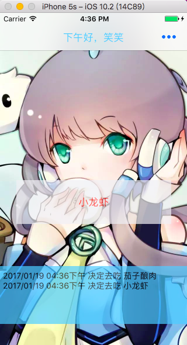
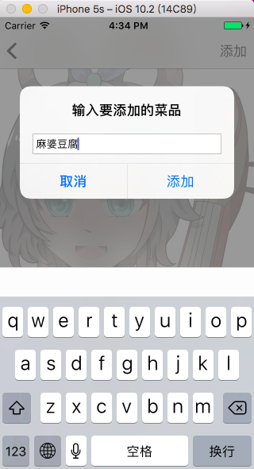

# whattoeat

## a simple application to solve your  allodoxaphobia before you meal.

This my practice project last year,it's a simple project.

包含的小知识点：
* 包含了一个简单的计算当前时间段是上午还是下午晚上等的小算法，当然你也可以自定义.
* 数据持久化NSUserdefaults的使用.
* UITableView的一些常用委托方法，包括cell的简单操作.
* 此外navigationController是通过storyboard拖拽出来的.

此外有一点需要注意，<mark>该项目不包含屏幕适配</mark>，运行的时候请使用4英寸的手机模拟器（iPhone SE）。
如果有能帮到你的地方那真是太好了。

--
 

by [Simon](https://codersimonpeter.github.io/blog)
